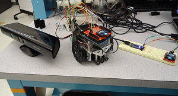
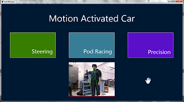
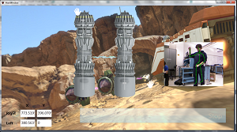
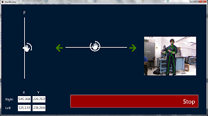
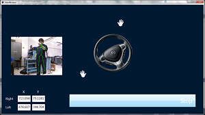
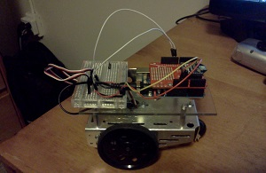

# Kinect Arduino Car #

## Summary ##

For the ES50 course in college, I created a Kinect application that accepts natural user input (ie, motion and voice input), parses the input into commands, and forwards the commands to a Arduino-powered car wirelessly.

## Description ##

I took an introductory electrical engineering class called [ES50](https://www.facebook.com/EngSci50){:target="_blank"} in the spring of my junior year.  I really enjoyed it, and it got me interested in using [Arduinos](http://arduino.cc){:target="_blank"} to automate things in real life, not just in the digital world.  In fact, the end result of the class can be seen in this video:

My final project for the class ended up being a lot heavier on the software side of things though.  I ended up designing and creating a <a href="http://www.xbox.com/en-US/kinect" target="_blank">Kinect</a> application that took in motion input and/or voice input, parsed the input into commands, and sent those commands over a wireless [Xbee](http://digi.com/xbee){:target="_blank"} connection to an Arduino-powered robotic car. 

The application has 3 "modes" which are basically 3 different ways to give motion input to the car. The application supports voice input for both controlling the car and navigating the application.

You can read the full specification for the project [here](http://iliketoprogram.com/assets/pdf/KinectSpec.pdf).  Enjoy!

## Screenshots ##

